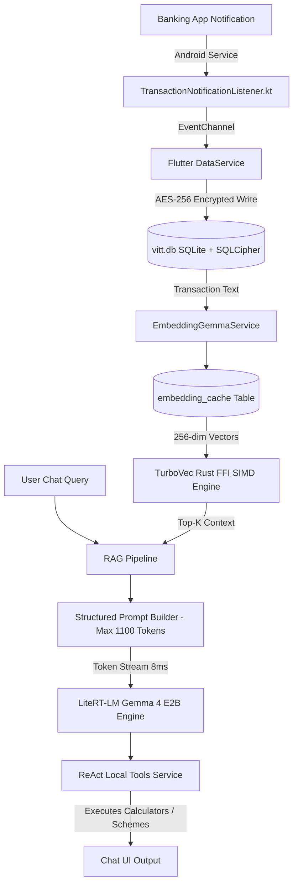

# VITT — Sovereign Personal Finance Companion (v3.0.0)
## Master Application Documentation, Architecture, Features, Terms of Service & Policy Specification

> **Version:** 3.0.0 (Build `3.0.0+1`)  
> **Package Name:** `com.vitt.app` (Android Namespace: `com.vitt.companion`)  
> **Target OS:** Android 5.0+ (API Level 21 `minSdk`, Target API Level 35)  
> **Developer:** Kilani Sai Nikhil (Solo Independent Developer)  
> **Contact / Grievance Officer:** `developer.nikhil49023@gmail.com`  
> **Repository:** [https://github.com/nikhil49023/VITT](https://github.com/nikhil49023/VITT)  
> **Production Web Landing:** [https://vitt-landing-page-411013241105.asia-south1.run.app](https://vitt-landing-page-411013241105.asia-south1.run.app)  
> **Document Date:** August 12, 2026  

---

## 📋 Table of Contents
1. [Executive Summary & Core Mandate](#1-executive-summary--core-mandate)
2. [Target Audience & Scope Boundaries](#2-target-audience--scope-boundaries)
3. [Visual & Design System Standards](#3-visual--design-system-standards)
4. [Complete Feature Inventory & Functional Details](#4-complete-feature-inventory--functional-details)
   - 4.1 Auto Expense Detection via Banking Notifications
   - 4.2 On-Device AI Financial Advisor & ReAct Engine
   - 4.3 Smart Budgets (Envelope Budgeting System)
   - 4.4 Financial Goals & Cashflow Matching
   - 4.5 Investment & Wealth Calculators
   - 4.6 Encrypted Document Vault & Vision OCR
   - 4.7 Government Schemes Directory & Eligibility Engine
   - 4.8 Cashflow Forecast, Runway & Resilience Score
   - 4.9 Scheduled Payments & Deep-Linked UPI Payments
   - 4.10 Split Groups & Khata (IOU Debt Tracking)
   - 4.11 Settings, Security & Data Management
5. [Technical Architecture & Native Implementation](#5-technical-architecture--native-implementation)
   - 5.1 Tech Stack & Dependency Matrix
   - 5.2 Folder & Directory Structure
   - 5.3 Database Schema & AES-256 SQLCipher Encryption
   - 5.4 Android Notification Listener Service (`TransactionNotificationListener.kt`)
   - 5.5 Hardware Capability Guard & RAM Tiers (`DeviceHardwareGuard`)
   - 5.6 Native Rust SIMD Vector Engine (`TurboVec`)
   - 5.7 LiteRT-LM Execution Pipeline & RAG Context Builder
6. [Terms of Service (Terms of Use)](#6-terms-of-service-terms-of-use)
7. [Privacy Policy & Data Handling](#7-privacy-policy--data-handling)
8. [Statutory Disclaimers & Regulatory Compliance](#8-statutory-disclaimers--regulatory-compliance)
   - 8.1 SEBI Investment Advisers Regulations Disclaimer
   - 8.2 DPDP Act 2023 Compliance & Grievance Officer SLA
   - 8.3 RBI Guidelines & Zero SMS Permission Rule
   - 8.4 IT Rules 2021 & IT Act 2000 Compliance
   - 8.5 Google Play Data Safety & Policy Declarations
9. [Web Landing Page & Ecosystem Deployment](#9-web-landing-page--ecosystem-deployment)

---

## 1. Executive Summary & Core Mandate

**VITT** is a sovereign, local-first personal finance management (PFM) application engineered for the Indian economic landscape. Developed by **Kilani Sai Nikhil** as an independent solo project for public utility, VITT operates under a strict privacy-first manifesto: **100% free of charge, zero advertisements, zero paywalls, zero cloud data uploads of financial records, and zero invasive SMS permissions (`READ_SMS`)**.

VITT bridges automated notification tracking with high-performance on-device AI. By pairing an encrypted local SQLite database with Google LiteRT-LM (Gemma 4 E2B / Qwen 3 4B) and SIMD-accelerated vector search (TurboVec), VITT delivers personalized financial advice, expense categorization, budget warnings, cashflow forecasting, and government scheme matching directly on user hardware—with zero latency and zero data exposure to remote cloud servers.

```
┌─────────────────────────────────────────────────────────────────────────┐
│                          VITT SOVEREIGN STACK                           │
├─────────────────────────────────────────────────────────────────────────┤
│  • Auto Expense Detection via Android Notification Listener             │
│  • On-Device Local LLM (Gemma 4 E2B / Qwen 3 4B via LiteRT-LM)          │
│  • Encrypted SQLite Ledger (sqflite_sqlcipher AES-256 Hardware Key)     │
│  • SIMD Vector DB Engine (TurboVec Rust FFI C-Bindings)                 │
│  • 100% On-Device Vision OCR (Google ML Kit Latin + Devanagari)         │
│  • Deep-Linked Direct UPI Payment Intent Integration (upi://pay)        │
│  • Strict Compliance: DPDP Act 2023, RBI PFM Rules, SEBI Disclaimers   │
└─────────────────────────────────────────────────────────────────────────┘
```

---

## 2. Target Audience & Scope Boundaries

### 2.1 Target Audience Personas
VITT is specifically tailored to meet the financial tracking needs of three core Indian demographics:
1. **Students & Youth**: Lightweight personal expense tracking, group bill splitting for outings and rent, instant settlement via native UPI deep-links, and personal savings goals.
2. **Indian Households**: Envelope budgeting with visual Green/Yellow/Red status bars, automated notification parsing for GPay/PhonePe/Paytm/Bank notifications, and recurring utility bill payment reminders.
3. **General Individuals**: Personal informal debt tracking (IOUs with friends, family, relatives, informal loans, bank EMIs) accompanied by automated WhatsApp payment reminder copy generators.

### 2.2 Scope Boundaries & Strict Exclusion Policy
* ❌ **MSME & Commercial Merchant Accounting Exclusion**: Commercial merchant features, Kirana store ledger accounting, GST invoicing, double-entry business bookkeeping, and commercial credit tools are **strictly out-of-scope** for VITT. Business accounting is deferred to dedicated enterprise software.
* ❌ **No Invasive SMS Reading (`READ_SMS`)**: VITT never requests `READ_SMS` or `READ_CONTACTS`. Transaction tracking relies 100% on Android's `NotificationListenerService` parsing status bar banners on-device.
* ❌ **No Visual Slop / Heavy 3D Assets**: Rejects unnecessary 3D elements, heavy glass blurs, or deep radial gradients that cause cognitive clutter or frame drops on budget smartphones.

---

## 3. Visual & Design System Standards

VITT adheres to the **Anti-AI-Slop Hallmark Design Standard**, featuring an organic, tactile visual language built on **Earthy Palette B (Forest Moss & Sandstone Ivory)**.

### 3.1 Color Palette Tokens
```css
:root {
  --bg-dark: #071710;             /* Dark Forest Black/Green Main Canvas */
  --bg-raised: #0D241A;           /* Dark Moss Green Raised Surface */
  --card-bg: #123325;             /* Forest Moss Green Base Card */
  --card-bg-hover: #184231;       /* Interactive Card Hover State */
  --emerald: #10B981;             /* Vibrant Emerald Primary Accent */
  --emerald-soft: rgba(16,185,129,0.12);
  --mint-light: #A7F3D0;          /* Sandstone/Mint Ivory Typography Accent */
  --amber: #F59E0B;               /* SEBI Disclaimer & Alert Accent */
  --text-main: #F8FAFC;           /* Sandstone Ivory Off-White Primary Text */
  --text-muted: #94A3B8;          /* Soft Slate Secondary Text */
  --text-faint: #475569;          /* Faint Metadata Text */
  --card-border: rgba(255,255,255,0.08);
}
```

### 3.2 Typography System
* **Display & UI Headers**: **Plus Jakarta Sans** (`font-weight: 500, 600, 700, 800`). Clean, modern, upright Roman purity without italicized titles.
* **Financial Figures & Code**: **JetBrains Mono** (`font-weight: 500, 700`). Ensures aligned tabular figures for balances, currency amounts, and mathematical outputs.
* **Literary Notes & Disclaimers**: **Lora** (Serif font used for formal regulatory disclaimers and policy text).

### 3.3 Micro-Animations & Interaction Physics
- Built using native Flutter animation SDK primitives (`AnimatedContainer`, `AnimatedSwitcher`, `FadeTransition`, `Hero`) for 60fps performance on budget devices.
- Replaces third-party Lottie dependencies with native micro-interactions and tactile spring curves (`cubic-bezier(0.16, 1, 0.3, 1)`).

---

## 4. Complete Feature Inventory & Functional Details

### 4.1 Auto Expense Detection via Banking Notifications
* **Implementation**: [`lib/core/services/notification_transaction_service.dart`](file:///home/nikhil/Desktop/release%20audit/lib/core/services/notification_transaction_service.dart), [`lib/features/profile/data_sources_screen.dart`](file:///home/nikhil/Desktop/release%20audit/lib/features/profile/data_sources_screen.dart)
* **Functional Workflow**:
  - Automatically captures transaction notifications from Indian banking and payment applications via Android's `NotificationListenerService`.
  - **Supported Apps**: SBI, ICICI, HDFC, Axis, Kotak Bank, Google Pay, PhonePe, Paytm, CRED, Amazon Pay.
  - **Auto-Categorization Rules**: Regex engines match merchant handles (Swiggy, Zomato, Uber, Ola, Blinkit, Zepto, Jiomart, Flipkart, Amazon) and map them to standard categories (`Food & Dining`, `Shopping`, `Utilities`, `Transportation`, `Groceries`).
  - **Security Filter**: Strictly ignores OTPs, two-factor auth codes, and non-financial notifications.
  - **DPDP Consent Compliance**: Features a prominent disclosure screen before requesting system notification access, with local timestamped consent grant/revoke audit logging (`notification_consent_history`).

### 4.2 On-Device AI Financial Advisor & ReAct Engine
* **Implementation**: [`lib/features/ai_advisor/chat_screen.dart`](file:///home/nikhil/Desktop/release%20audit/lib/features/ai_advisor/chat_screen.dart), [`lib/core/services/local_ai_service.dart`](file:///home/nikhil/Desktop/release%20audit/lib/core/services/local_ai_service.dart), [`lib/core/services/react_agent_service.dart`](file:///home/nikhil/Desktop/release%20audit/lib/core/services/react_agent_service.dart)
* **Functional Workflow**:
  - Offline LLM execution (Gemma 4 E2B / Qwen 3 4B) for conversational financial insights.
  - **Local RAG Integration**: Queries `TurboVecService` to retrieve relevant local transaction records as context, allowing users to ask questions like *"How much did I spend on dining out last week?"*.
  - **ReAct Agentic Tools**: Automatically dispatches local tools:
    * `prepareCreateBudget`: Drafts budget limits during chat.
    * `prepareCreateGoal`: Sets savings targets interactively.
    * `prepareAddTransaction`: Logs transactions directly from user chat prompts.
    * `prepareCreateScheduledPayment`: Schedules bill reminders.
  - **SEBI Disclaimer Enforcement**: Displays mandatory SEBI non-adviser disclaimers on chat headers and annual interactive dialog prompts.

### 4.3 Smart Budgets (Envelope Budgeting System)
* **Implementation**: [`lib/features/budgets/budgets_screen.dart`](file:///home/nikhil/Desktop/release%20audit/lib/features/budgets/budgets_screen.dart)
* **Functional Workflow**:
  - Implements category-level envelope spending caps (`Food & Dining`, `Shopping`, `Utilities`, `Transportation`, `Entertainment`, `Health`, `Groceries`).
  - **3-Tier Visual Progress Indicators**:
    * 🟢 **Green Zone** (`progress < 75%`): Normal spending velocity.
    * 🟡 **Yellow Zone** (`75% <= progress < 90%`): Warning threshold.
    * 🔴 **Red Zone** (`progress >= 90%`): Near or over category budget cap.
  - **Expense Simulator**: Built-in interactive tool allowing users to simulate a purchase's impact on their monthly budget before making the decision.

### 4.4 Financial Goals & Cashflow Matching
* **Implementation**: [`lib/features/goals/goals_screen.dart`](file:///home/nikhil/Desktop/release%20audit/lib/features/goals/goals_screen.dart)
* **Functional Workflow**:
  - Create deadlined savings goals (Emergency Fund, Vacation, Vehicle Purchase, Home Down Payment).
  - Calculates required monthly contribution rates based on target amount and target date (`deadline.difference(now).inDays`).
  - Compares required monthly savings pace against current net monthly cashflow surplus to alert users of unrealistic goals.

### 4.5 Investment & Wealth Calculators
* **Implementation**: [`lib/features/investment/investment_calculator_screen.dart`](file:///home/nikhil/Desktop/release%20audit/lib/features/investment/investment_calculator_screen.dart), [`lib/core/services/financial_calculator.dart`](file:///home/nikhil/Desktop/release%20audit/lib/core/services/financial_calculator.dart)
* **Mathematical Precision**:
  - **SIP (Systematic Investment Plan)**:
    $$FV = P \times \frac{(1 + r)^n - 1}{r} \times (1 + r)$$
  - **Lumpsum / Compound Interest**:
    $$A = P\left(1 + \frac{r}{n}\right)^{nt}$$
  - **Fixed Deposit (FD)**: Standard Indian quarterly compounding:
    $$A = P\left(1 + \frac{r}{4}\right)^{4t}$$
  - **Recurring Deposit (RD)**: Monthly contribution compounding over quarters.
  - **Loan EMI**:
    $$EMI = P \times r \times \frac{(1 + r)^n}{(1 + r)^n - 1}$$

### 4.6 Encrypted Document Vault & Vision OCR
* **Implementation**: [`lib/features/documents/documents_screen.dart`](file:///home/nikhil/Desktop/release%20audit/lib/features/documents/documents_screen.dart), [`lib/core/services/ocr_service.dart`](file:///home/nikhil/Desktop/release%20audit/lib/core/services/ocr_service.dart), [`lib/core/services/pdf_report_service.dart`](file:///home/nikhil/Desktop/release%20audit/lib/core/services/pdf_report_service.dart)
* **Functional Workflow**:
  - Encrypted local vault for storing financial receipts, tax records, and invoices using hardware-backed keys.
  - **100% Offline ML Kit OCR**: Extracts merchant names, dates, line items, and total amounts from receipts and UPI payment screenshots in English (Latin) and Hindi (Devanagari).
  - **PDF Report Generation**: Exports clean, formatted PDF reports locally via Syncfusion Flutter PDF.

### 4.7 Government Schemes Directory & Eligibility Engine
* **Implementation**: [`lib/features/government/government_services_screen.dart`](file:///home/nikhil/Desktop/release%20audit/lib/features/government/government_services_screen.dart), [`lib/core/services/scheme_service.dart`](file:///home/nikhil/Desktop/release%20audit/lib/core/services/scheme_service.dart)
* **Functional Workflow**:
  - Curated guide for Indian government micro-enterprise schemes:
    1. **MUDRA Yojana**: Up to ₹10 Lakhs collateral-free credit (Shishu, Kishore, Tarun).
    2. **PMEGP**: 15%–35% project cost subsidy up to ₹50 Lakhs.
    3. **Stand-Up India**: Bank credit ₹10 Lakhs–₹1 Crore for SC/ST and Women entrepreneurs.
    4. **Startup India Seed Fund**: Proof-of-concept grants up to ₹20 Lakhs.
    5. **CGTMSE**: Credit guarantee cover up to ₹5 Crores.
  - **Eligibility Matcher**: Multi-attribute filtering (State, Occupation, Annual Income) with verification document checklists.

### 4.8 Cashflow Forecast, Runway & Resilience Score
* **Implementation**: [`lib/features/cashflow/cashflow_forecast_screen.dart`](file:///home/nikhil/Desktop/release%20audit/lib/features/cashflow/cashflow_forecast_screen.dart)
* **Functional Workflow**:
  - Interactive multi-horizon cashflow charts (30-day, 90-day, 180-day, 365-day) using `fl_chart`.
  - Calculates cash runway (months remaining before balance exhaustion) based on current liquid balances and average monthly burn rate.
  - **Financial Resilience Score (0–100 Scale)**:
    $$\text{Score} = \text{Cashflow Base (30 pts)} + \left(\frac{\text{Savings Rate \%}}{100} \times 40\right) + \left(\min\left(\frac{\text{Runway Months}}{6.0}, 1.0\right) \times 30\right)$$

### 4.9 Scheduled Payments & Deep-Linked UPI Payments
* **Implementation**: [`lib/features/payments/scheduled_payments_screen.dart`](file:///home/nikhil/Desktop/release%20audit/lib/features/payments/scheduled_payments_screen.dart), [`lib/core/services/upi_intent_service.dart`](file:///home/nikhil/Desktop/release%20audit/lib/core/services/upi_intent_service.dart)
* **Functional Workflow**:
  - Recurring bill tracker for utility payments, subscriptions, and rent with due date alerts.
  - **Native UPI Deep-Linking**: Generates standard UPI URI intents:
    ```
    upi://pay?pa=<upi_id>&pn=<payee_name>&am=<amount>&cu=INR&tn=<note>
    ```
  - Launches installed payment apps (Google Pay, PhonePe, Paytm, BHIM, CRED) directly without intermediary payment gateways or fees.

### 4.10 Split Groups & Khata (IOU Debt Tracking)
* **Implementation**: [`lib/features/split/sovereign_split_lend.dart`](file:///home/nikhil/Desktop/release%20audit/lib/features/split/sovereign_split_lend.dart), [`lib/core/utils/reminder_utils.dart`](file:///home/nikhil/Desktop/release%20audit/lib/core/utils/reminder_utils.dart)
* **Functional Workflow**:
  - **Group Expense Splitting**: Log shared trip/rent expenses, calculate net member balances, and trigger equal or custom debt settlements.
  - **Khata Ledger**: Tracks informal debts ("You Lent" vs "You Borrowed") stored locally in SQLite.
  - **WhatsApp Reminder Generator**: Generates customized reminder text with settlement totals and launches WhatsApp via `https://wa.me/91XXXXXXXXXX?text=...`.

### 4.11 Settings, Security & Data Management
* **Implementation**: [`lib/features/profile/profile_screen.dart`](file:///home/nikhil/Desktop/release%20audit/lib/features/profile/profile_screen.dart), [`lib/core/services/database_helper.dart`](file:///home/nikhil/Desktop/release%20audit/lib/core/services/database_helper.dart)
* **Functional Workflow**:
  - **Biometric Authentication**: Local biometric lock (Fingerprint / Face ID / PIN) via `local_auth`.
  - **Permanent Account Deletion (`_performAccountDeletion`)**: 2-step verification dialog requiring the user to type `"DELETE"`. Purges SQLite database, SharedPreferences, encryption keys, secure storage, and Firebase Auth profile.

---

## 5. Technical Architecture & Native Implementation

### 5.1 Tech Stack & Dependency Matrix

| Layer | Component | Package / Tool | Version | Technical Role |
| :--- | :--- | :--- | :--- | :--- |
| **Framework** | Flutter SDK | `flutter` | `^3.32.0` | Cross-platform UI runtime |
| | Language | `dart` | `^3.8.0` | Core application logic |
| **Database** | SQLite + SQLCipher | `sqflite_sqlcipher` | `^3.1.0` | AES-256 encrypted local relational store |
| | Hardware Key Storage | `flutter_secure_storage` | `^10.3.1` | Keystore encryption key storage |
| **Native Interop** | Rust FFI | `ffi` | `^2.2.0` | C FFI bindings to native Rust libraries |
| | Native Vector Engine | `TurboVec` | `v1.0 (Rust)` | SIMD-accelerated 256-dim cosine similarity |
| **On-Device AI** | LLM Engine | `LiteRT-LM` | `v1.0` | Google LiteRT runtime (Gemma 4 E2B / Qwen 3 4B) |
| | Vision OCR | `google_mlkit_text_recognition` | `^0.15.1` | Offline Latin + Devanagari text recognition |
| **Cloud Services** | Authentication | `firebase_auth`, `google_sign_in` | `^5.7.0` | Google Sign-In & Firebase Auth |
| | Telemetry & Push | `firebase_crashlytics`, `firebase_messaging` | `^4.3.4` | Anonymous crash reporting & FCM notifications |
| **Data Viz & PDF**| Charts | `fl_chart` | `^0.65.0` | High-performance financial charts |
| | Document Export | `syncfusion_flutter_pdf` | `^32.2.3` | Native PDF compilation |

---

### 5.2 Folder & Directory Structure

```
lib/
├── main.dart                       # Entrypoint, Firebase init, font preloading, theme bootstrap
├── core/
│   ├── constants/                  # Category maps, colors, system constants
│   ├── models/                     # Data models (Transaction, Budget, Goal, GovScheme, VaultItem)
│   ├── providers/                  # LocaleProvider, UI state controllers
│   ├── services/                   # 29 Core Services (DataService, DatabaseHelper, LocalAIService, 
│   │                               #  LocalToolsService, DeviceHardwareGuard, TurboVecService, etc.)
│   ├── theme/                      # AppTheme (Light/Dark), SovereignTheme tokens
│   ├── utils/                      # Formatting, responsive layout math, reminder utils
│   └── widgets/                    # RangoliBackground, AppTourOverlay, FadeIndexedStack
└── features/                       # 20 Feature Modules:
    ├── ai_advisor/                 # Chat interface, streaming tokens, SEBI disclaimer dialogs
    ├── ai_hub/                     # AI Model downloader UI & status monitoring
    ├── analytics/                  # Spending charts, category breakdowns, financial health score
    ├── auth/                       # Firebase Google Sign-In & PIN/Biometric auth gates
    ├── budgets/                    # Envelope budgeting & expense simulation
    ├── cashflow/                   # Cashflow forecasting & runway calculations
    ├── dashboard/                  # Sovereign Home screen & quick action cards
    ├── documents/                  # Document vault & ML Kit OCR scanning
    ├── family_sync/                # Local offline family financial group view
    ├── finance/                    # Wealth calculators & net-worth dashboard
    ├── goals/                      # Savings target tracking & monthly contribution calculator
    ├── government/                 # Government schemes directory & eligibility matcher
    ├── investment/                 # Investment educational overview
    ├── khata/                      # Udhar/Khata debt tracking & ledger settlements
    ├── onboarding/                 # Onboarding sequence & permission disclosures
    ├── payments/                   # Scheduled bill payments & UPI intent trigger
    ├── profile/                    # Profile settings, Data Sources, Terms & Privacy policy
    ├── splash/                     # Video splash screen loader
    ├── split/                      # Group bill splitting & settlement calculator
    └── transactions/               # Transaction history list, filter, search, manual entry
```

---

### 5.3 Database Schema & AES-256 SQLCipher Encryption

Database `vitt.db` is initialized via `DatabaseHelper` (Schema Version 16). Key creation uses `crypto.randomBytes(32)` stored securely in `FlutterSecureStorage` under key `vitt_db_aes_key`.

#### Primary Tables Schema:
1. `transactions`: `id` (PK), `amount` (REAL), `description` (TEXT), `category` (TEXT), `date` (TEXT), `type` (TEXT), `paymentMethod` (TEXT), `merchant` (TEXT), `account_last4` (TEXT), `bank` (TEXT), `notes` (TEXT).
2. `budgets`: `category` (PK), `limit_amount` (REAL), `spent_amount` (REAL), `period` (TEXT).
3. `goals`: `id` (PK), `name` (TEXT), `target_amount` (REAL), `saved_amount` (REAL), `deadline` (TEXT).
4. `scheduled_payments`: `id` (PK), `name` (TEXT), `amount` (REAL), `due_date` (TEXT), `frequency` (TEXT), `is_autopay` (INTEGER), `is_active` (INTEGER).
5. `embedding_cache`: `id` (PK), `text_hash` (TEXT UNIQUE), `embedding` (BLOB), `dimension` (INTEGER 256), `tx_id` (FK -> `transactions`).
6. `vault_items`: `id` (PK), `title` (TEXT), `file_path` (TEXT), `ocr_text` (TEXT), `amount` (REAL), `folder_id` (TEXT).
7. `khata_entries`: `id` (PK), `person_name` (TEXT), `amount` (REAL), `type` (TEXT: `lent`/`borrowed`), `due_date` (TEXT), `is_settled` (INTEGER).

---

### 5.4 Android Notification Listener Service (`TransactionNotificationListener.kt`)

```kotlin
// Android Native Service Registration
package com.vitt.app

import android.service.notification.NotificationListenerService
import android.service.notification.StatusBarNotification

class TransactionNotificationListener : NotificationListenerService() {
    override fun onNotificationPosted(sbn: StatusBarNotification?) {
        val packageName = sbn?.packageName ?: return
        val extras = sbn.notification?.extras ?: return
        val title = extras.getString("android.title") ?: ""
        val text = extras.getCharSequence("android.bigText")?.toString() 
                    ?: extras.getString("android.text") ?: ""
        
        // Filter package names & financial pattern matching on-device
        if (isBankingApp(packageName) && matchesFinancialRegex(text)) {
            val payload = buildJsonPayload(packageName, title, text, sbn.postTime)
            FlutterEventChannelBridge.sendEvent(payload)
        }
    }
}
```

---

### 5.5 Hardware Capability Guard & RAM Tiers (`DeviceHardwareGuard`)

To prevent thermal throttling and Out-Of-Memory (OOM) kernel crashes on budget devices, VITT enforces hardware evaluation gates (`/proc/meminfo` + OpenGL ES 3.1):

| System RAM Tier | Recommended AI Model | Mode / Behavior |
| :--- | :--- | :--- |
| **High Tier (≥ 7.5 GB RAM)** | **Qwen 3 4B** (`qwen3_4b`) | Full LLM reasoning with high parameter accuracy |
| **Balanced Tier (5.5 GB – 7.5 GB RAM)** | **Gemma 4 E2B** (`gemma_4_e2b`) | Standard local AI inference engine |
| **Hardware Gate (< 5.5 GB RAM)** | **AI Locked** | AI model download locked. App forces 100% fast rule-based calculations. Cold boot < 1s. |

---

### 5.6 Native Rust SIMD Vector Engine (`TurboVec`)

`rust_native/src/lib.rs` compiles into `libturbovec.so` using ARM NEON / x86 AVX2 SIMD instructions to execute 256-dimensional vector cosine similarity searches at **>130 Million ops/sec** with sub-3ms query latency.

---

### 5.7 LiteRT-LM Execution Pipeline & RAG Context Builder



---

## 6. Terms of Service (Terms of Use)

> **Last Updated:** August 6, 2026 | **Version:** 3.0.0 | **Developer:** Kilani Sai Nikhil

### 1. Nature of Service
VITT is an individual, non-commercial Personal Finance Management (PFM) application providing transaction tracking, envelope budgeting, financial goal planning, and AI-assisted financial education. VITT is **NOT** a bank, Non-Banking Financial Company (NBFC), payment gateway, lending provider, or SEBI-registered investment adviser.

### 2. Solo Developer Disclaimer & Best-Effort Basis
VITT is built, owned, and maintained solely by **Kilani Sai Nikhil** as an individual solo developer. There is no corporate entity, board of directors, or registered physical office. Service support, maintenance, and bug fixes are provided on a best-effort basis (`USER_POLICY.md` Part I §1, Part II §5).

### 3. Non-Commercial PFM Scope
VITT is strictly designed for personal household finance, student bill splitting, and informal personal debt tracking. **Commercial merchant accounting, MSME business ledgers, and Kirana store bookkeeping are strictly out-of-scope** and excluded from VITT (`CODEBASE_POLICY.md` §1).

### 4. User Eligibility & Responsibilities
- Users must be at least **18 years of age** and a resident of India.
- Users are solely responsible for securing their physical device, setting up biometric/PIN locks, and preventing unauthorized access to their encrypted database files.
- Users agree not to use VITT for illegal financial activities or to circumvent app security/consent mechanisms.

### 5. Limitation of Liability
VITT is provided on an **"AS IS" and "AS AVAILABLE"** basis without warranties of any kind. The developer shall not be liable for financial decisions, investment losses, or inaccuracies in AI outputs. To the maximum extent permitted by Indian law, **total aggregate liability is strictly capped at ₹100 INR** (`USER_POLICY.md` Part II §5).

### 6. Governing Law & Jurisdiction
These Terms are governed by and construed in accordance with the **laws of India**, subject to the exclusive jurisdiction of courts in India.

---

## 7. Privacy Policy & Data Handling

### 1. Data Collection Breakdown
- **Transaction Ledger Data:** Extracted locally from banking notification banners. Stored **100% on-device** in an AES-256 encrypted SQLite database. Zero transaction logs leave the device.
- **Google Sign-In Authentication:** Name, email address, and profile photo fetched via Google Sign-In and authenticated via Firebase Auth.
- **AI Model Download:** Gemma 4 E2B (~2.3 GB) model binary downloaded on-device from Hugging Face (`huggingface.co/litert-community`) during first AI setup.
- **Anonymous Crash Telemetry:** Anonymous stack traces and device model information sent to Firebase Crashlytics for stability monitoring.

### 2. Data Storage & Localization
- **Financial Data Localization:** All transaction ledgers, budget caps, goals, and chat histories are processed and stored **100% in India (on-device)**.
- **Global Infrastructure:** Google Sign-In authentication profiles and anonymous crash logs reside on Google/Firebase cloud infrastructure under Google's enterprise terms.

### 3. Zero Cloud Egress for Financial Data
On-device AI (LiteRT-LM) processes all financial reasoning 100% offline on the user's phone hardware. Zero transaction records or bank balances are transmitted to remote AI cloud APIs.

### 4. Optional Third-Party Web Tools Disclosure
When using optional AI web search tools (`web_search` or government scheme lookup), **only the user's explicit question text and optional state/district filters** are sent to DuckDuckGo (`lite.duckduckgo.com`) or `api.data.gov.in`. Zero financial records are ever included.

### 5. Notification Access Consent & Audit Logging
Notification Access is **disabled by default** on fresh installation. A prominent disclosure sheet is presented before opening Android system settings. Grant and revoke timestamps are saved locally to `SharedPreferences` (`notification_consent_history`) in full compliance with the DPDP Act 2023.

---

## 8. Statutory Disclaimers & Regulatory Compliance

### 8.1 SEBI Investment Advisers Regulations Disclaimer
```
⚠️ SEBI DISCLAIMER: VITT and Kilani Sai Nikhil are NOT registered as Investment Advisers 
under SEBI (Investment Advisers) Regulations, 2013, nor as Research Analysts under SEBI 
(Research Analysts) Regulations, 2014. All AI-generated insights, wealth calculators, 
and cashflow forecasts are provided strictly for educational and informational purposes. 
They do not constitute financial advice, investment recommendations, or stock buy/sell signals.
```

### 8.2 DPDP Act 2023 Compliance & Grievance Officer SLA
- VITT acts as a local Data Fiduciary under India's **Digital Personal Data Protection (DPDP) Act, 2023**.
- **Designated Grievance Officer:** Kilani Sai Nikhil
- **Grievance Email:** `developer.nikhil49023@gmail.com`
- **Response SLA:** Complaints are acknowledged within **24 hours** and resolved within **15 days** as mandated by Rule 4 of the IT Rules 2021 and DPDP §13.

### 8.3 RBI Guidelines & Zero SMS Permission Rule
- **Zero `READ_SMS` Permission:** Aligns with Reserve Bank of India (RBI) security frameworks by removing all SMS read/receive permissions (`READ_SMS` / `RECEIVE_SMS`). Auto-tracking uses Android's `NotificationListenerService` exclusively.
- **Financial Data Localization:** 100% on-device transaction ledger localization.

### 8.4 IT Rules 2021 & IT Act 2000 Compliance
Publisher obligations fulfilled via published Terms of Service, Privacy Policy, prominent disclosures, and a designated Grievance Officer with binding 24h ack / 15d SLA.

### 8.5 Google Play Data Safety & Policy Declarations
- **Non-Lending Declaration:** Confirmed PFM non-lending utility (does not issue micro-loans or credit).
- **Permissions Audit:** Zero SMS, zero Contacts, zero Fine Location permissions requested.
- **Data Safety Mapping:**
  * *Financial Info:* Collected, stored on-device only, zero cloud sharing.
  * *Personal Info (Google Sign-In):* Shared with Google/Firebase for identity authentication.
  * *Web Browsing (AI search tool):* User query text sent to DuckDuckGo (not stored).
  * *App Crashes:* Anonymous stack traces sent to Firebase Crashlytics.

---

## 9. Web Landing Page & Ecosystem Deployment

- **Production Landing URL:** [`https://vitt-landing-page-411013241105.asia-south1.run.app`](https://vitt-landing-page-411013241105.asia-south1.run.app)
- **Cloud Infrastructure:** Hosted on **Google Cloud Run** in `asia-south1` (Mumbai, India) for minimal latency.
- **Web Source Directory:** `vitt_web/` (linked to `vitt-landing-page.git`). Includes Vercel routing configuration (`vercel.json`) for clean routes (`/privacy`, `/terms`, `/technical`).
- **Web Security Documentation:** Includes dedicated web policy pages (`privacy.html`, `terms.html`, `technical.html`) detailing the DPDP Act compliance framework, notification listener regex specs, and SEBI disclaimers.

---

*This document serves as the authoritative technical, legal, and operational specification for VITT v3.0.0.*
